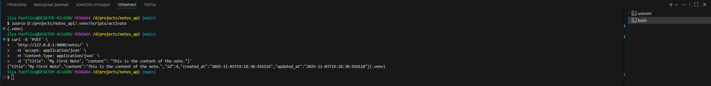

# Notes API

> RESTful API для управления заметками, разработанное с использованием FastAPI и SQLAlchemy.


## 📋 Содержание

- [Описание](#-описание)
- [Функциональность](#-функциональность)
- [Технологии](#-технологии)
- [Установка и запуск](#-установка-и-запуск)
- [Документация API](#-документация-api)
- [Тестирование](#-тестирование)
- [Структура проекта](#-структура-проекта)
- [Примеры использования](#-примеры-использования)
- [Автор](#-автор)

## 🚀 Описание

Этот проект представляет собой простое, но функциональное веб-API для создания, чтения, обновления и удаления заметок (CRUD). Он демонстрирует современные практики разработки backend-приложений на Python с использованием FastAPI, асинхронной работы с базой данных через SQLAlchemy и асинхронного движка `aiosqlite`.



## ✨ Функциональность

- **Создание заметки**: `POST /notes/`
- **Получение списка заметок с пагинацией**: `GET /notes/`
- **Получение заметки по ID**: `GET /notes/{id}`
- **Обновление заметки по ID**: `PUT /notes/{id}` (требуется хотя бы одно из полей `title` или `content`)
- **Удаление заметки по ID**: `DELETE /notes/{id}`
- **Автоматическая документация API**: Swagger UI и ReDoc

## 🛠️ Технологии

- **FastAPI**: Современный, быстрый (высокая производительность) веб-фреймворк для создания API с Python 3.7+ на основе аннотаций типов.
- **SQLAlchemy**: Популярный ORM (Object-Relational Mapping) для Python, обеспечивающий гибкую работу с базами данных.
- **SQLite**: Встраиваемая реляционная база данных, используемая в проекте для простоты разработки и тестирования.
- **aiosqlite**: Асинхронный интерфейс для SQLite, позволяющий использовать её в асинхронных приложениях.
- **Pydantic**: Библиотека для валидации данных и настройки конфигураций, используемая FastAPI для обработки запросов и ответов.
- **uvicorn**: Лёгкий ASGI-сервер для запуска FastAPI-приложений.
- **pytest**: Фреймворк для написания и запуска тестов.

## 🚀 Установка и запуск

1.  **Клонируйте репозиторий:**

    ```bash
    git clone https://github.com/panfiloow/notes_api.git
    cd notes_api
    ```

2.  **Создайте и активируйте виртуальное окружение:**

    ```bash
    python -m venv .venv
    source .venv/bin/activate # Linux/Mac
    # или
    .venv\Scripts\activate # Windows
    ```

3.  **Установите зависимости:**

    ```bash
    pip install -r requirements.txt
    # или, если requirements.txt нет, установите пакеты вручную:
    # pip install fastapi uvicorn sqlalchemy aiosqlite pydantic pytest
    ```

4.  **Запустите приложение:**

    ```bash
    # Из корня проекта (notes_api/)
    uvicorn src.main:app --reload --host 127.0.0.1 --port 8000
    ```

    Приложение будет доступно по адресу `http://127.0.0.1:8000`.

## 📚 Документация API

FastAPI автоматически генерирует интерактивную документацию API:

- **Swagger UI**: [http://127.0.0.1:8000/docs](http://127.0.0.1:8000/docs)
- **ReDoc**: [http://127.0.0.1:8000/redoc](http://127.0.0.1:8000/redoc)


## 🧪 Тестирование

Для запуска тестов используйте `pytest`:

```bash
# Из корня проекта (notes_api/)
pytest tests/
# или для подробного вывода:
pytest tests/ -v
# или с отображением print():
pytest tests/ -v -s
```

## 📁 Структура проекта

notes_api/
├── src/
│   ├── __init__.py
│   ├── main.py          # Основное приложение FastAPI
│   ├── database.py      # Настройка подключения к БД
│   ├── models.py        # Определение ORM-моделей
│   ├── schemas.py       # Pydantic-схемы для валидации данных
│   └── crud.py          # Логика CRUD-операций и маршруты
├── tests/
│   ├── __init__.py
│   └── test_api.py      # Тесты для API
├── .gitignore
├── README.md            # Этот файл
└── requirements.txt     # Зависимости проекта (если есть)

## 👤 Автор

[Илья Панфилов](https://github.com/panfiloow) - Python Backend Developer.